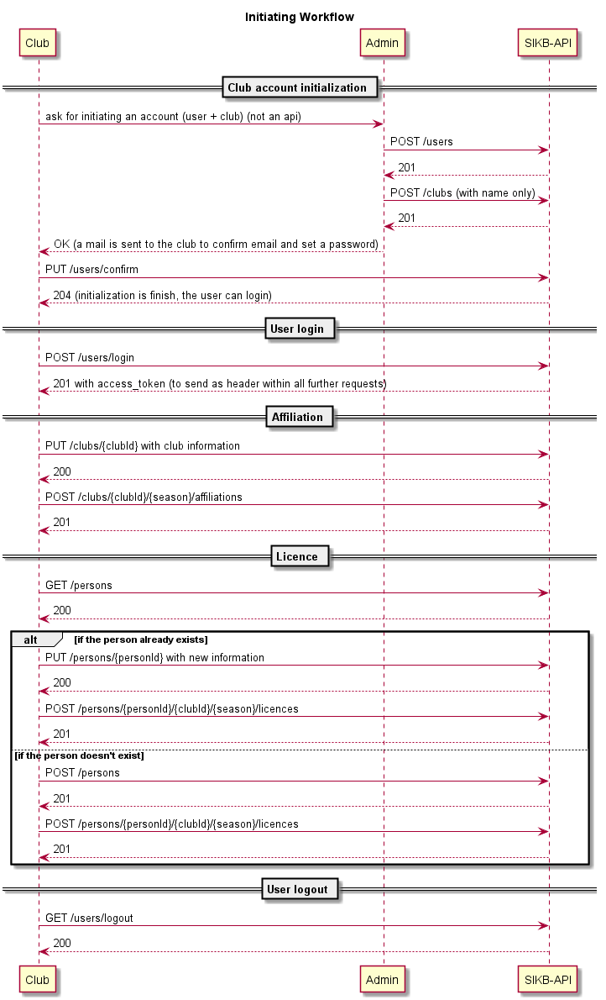

# sikb-api     

## WARNING
These APIs are still in progress from a functional point of view and technical feasibility.

## Documentation

You can tryout APIs [here](http://ec2-35-180-42-251.eu-west-3.compute.amazonaws.com:8080/sikb/swagger-ui/).

You need to set authorization in order to able to use apis. Use : test/test

### Api Subscription
Anyone wanting to consume these APIs need to send an email to thierry.boschat@kin-ball.fr

### Workflow

1. A club need to send an email to thierry.boschat@kin-ball.fr to get their account initialized
2. Then after confirming his identity and update password, the club can log into the platform
3. Then the club is free to update jis information and create an affiliation

## Contributing

TODO

## Getting Help

Ask SIKB-API related questions to thierry.boschat@kin-ball.fr.

## Continuous Integration Builds

| CI Server | OS           | Status | Description |
| --------- | ------------ | ------ | ----------- |
| Travis CI | Linux, macOS |  | Official CI build server for SIKB-API. Used to perform quick checks on submitted pull requests and for build matrices including the latest released OpenJDK and early access builds of the next OpenJDK |

## Code Coverage

Code coverage using [JaCoCo] for the latest build is available on [Codecov].

A code coverage report can also be generated locally via the [Maven] by
executing `mvn clean install`. The results will be available
in `target/reports/jacoco/jacocoRootReport/html/index.html`.

## Building from Source

You need [JDK 8] to build SIKB-API.

All modules can be build with the [Maven] using the following command.

`mvn clean install`

To perform a successful build, you need to have a running postgresSQL instance withe a database named `sikb` with the right structure (persistence\src\main\resources\initdb.sql). 

You can either use [Docker] configuration (docs\docker\compose.yml) or download your own [PostgresSQL].

## Tools

* You can modify sequence diagrams (docs/schema/*.plantuml) with [Planttext]
* You can view and modify Swagger (docs/swagger/) with [Swagger Editor]
* You can view and modify Jasper template (server/src/main/resources/templates/licence) with [Jaspersoft® Studio CE] 
* you can run a postgreSQL docker instance with [Docker]

[Planttext]: https://www.planttext.com/
[Swagger Editor]: https://editor.swagger.io/
[Jaspersoft® Studio CE]: https://community.jaspersoft.com/community-download/
[JaCoCo]: http://www.eclemma.org/jacoco/
[Codecov]: https://codecov.io/gh/alexeil/sikb-api
[Maven]: https://maven.apache.org/
[JDK 8]: https://jdk.java.net/8/
[PostgresSQL]: https://www.postgresql.org/
[Docker]: https://www.docker.com/
